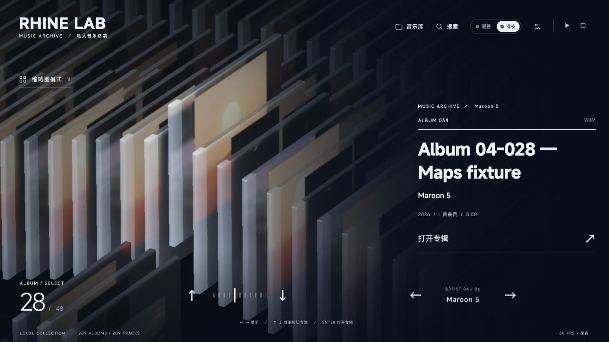

# Rhine Music Demo · V0.4.1

**把本地音乐放进三维专辑架，一张一张，慢慢听。** 用玻璃 CD 盒浏览收藏，打开专辑、查找歌曲，在浏览器界面中播放自己的音乐。

本版提供 **macOS 源码包**，由本机 Node.js 服务与浏览器共同运行。源码包不是 `.app` 安装包，不附带歌曲；普通使用无需 Blender。

音乐适配与维护：[RonaldDeng](https://github.com/RonaldDeng) · 基于 [LBEILC / RhineLabUI](https://github.com/LBEILC/RhineLabUI)

[**下载 V0.4.1 macOS 源码包**](https://github.com/RonaldDeng/Rhine-Music-Demo/releases/download/v0.4.1/Rhine-Music-Demo-v0.4.1-macOS.zip) · [V0.4.1 Release](https://github.com/RonaldDeng/Rhine-Music-Demo/releases/tag/v0.4.1) · [更新日志](CHANGELOG.md) · [版权与来源](NOTICE.md)

**Windows 与其他开发方向：** 请看 [社区衍生版本](docs/COMMUNITY-VERSIONS.md)。各版本由对应作者独立维护，功能与支持范围以其文档为准。



*使用隔离示例库与内置演示封面采集。画面中的名称和数量用于界面验证，不包含私人音乐，也不代表真实曲库播放测试。*

## 开始使用

### 准备运行环境

| 依赖 | 用途 |
| --- | --- |
| [Node.js](https://nodejs.org/) ≥ 22.12.0，含 npm | 启动本机服务，安装依赖并构建界面。 |
| 支持 WebGL 2 的现代浏览器 | 显示三维专辑架；默认使用浏览器音频输出。 |
| FFmpeg 与 ffprobe | 完整的多格式解码，包括 APE、WavPack 和 DSD 转 PCM；需自行安装，不随源码包提供。 |
| Apple Command Line Tools，含 `swiftc` | 选择 Mac 原生 CoreAudio 输出时需要；首次使用会在本机编译音频桥接程序。 |

可在终端用 `node --version`、`npm --version`、`ffmpeg -version`、`ffprobe -version` 和 `swiftc --version` 检查对应依赖。若未安装 Apple Command Line Tools，可运行 `xcode-select --install`。缺少音频依赖时，设置会显示原因；浏览器仍可尝试直接播放自身支持的原始文件。

### 启动与添加音乐

1. 下载并完整解压 `Rhine-Music-Demo-v0.4.1-macOS.zip`，进入 `V0.4.1/` 文件夹。
2. 双击 **[`启动音乐播放器.command`](启动音乐播放器.command)**。首次启动需要联网安装锁定依赖并构建界面，随后打开默认浏览器；日常启动会复用有效构建及同一工程已有的服务。
3. 点击“**音乐库**”，填写音乐文件夹的**绝对路径**，例如 `/Users/你的用户名/Music`，保存并扫描。

尚未添加音乐时，可选择“先查看演示封面”，或运行 **[`tools/launchers/启动演示.command`](tools/launchers/启动演示.command)**。演示只有三张内置封面，没有可播放曲目。

<details>
<summary>双击无法启动，或希望从终端运行</summary>

在终端进入解压后的工程目录，执行：

```sh
bash "启动音乐播放器.command"
```

若可执行权限丢失，可执行 `chmod +x "启动音乐播放器.command"` 后再双击。提示找不到 Node.js / npm 时，安装符合版本要求的 Node.js，再重新打开终端。

也可以手动启动前台服务：

```sh
npm ci
npm run build
npm run music -- --port 5175
```

打开终端显示的本机地址，通常是 [http://127.0.0.1:5175/](http://127.0.0.1:5175/)。前台服务用 `Ctrl+C` 停止。

双击启动器默认从 5175 开始寻找可用端口，启动的是后台服务；关闭终端或浏览器不会停止服务。日志保存在数据目录的 `player-service.log`。更新前可在 macOS“活动监视器”中找到此工程对应的 Node 音乐服务进程并退出。

`npm run dev` / `npm run preview` 仅提供前端，不能替代本地音乐服务。

</details>

## 本版功能与操作

| 功能 | 使用方式 |
| --- | --- |
| 专辑架与详情 | 按流派、歌手或专辑名排列，使用方向键、底部滑尺或滚轮浏览。打开专辑后查看曲目、介绍及制作信息，点击歌曲开始播放。 |
| 缩略图总览 | 按 `V` 或点击“缩略图模式”拉远镜头。点击列名会在原地展开“进入 →”，再点击进入才定位该列并返回标准视图；点击专辑、`Esc` 或 `V` 也可返回。播放歌名保留，播放控件位置固定。 |
| 真实专辑列 | 设置 → 高级设置 · 专辑阵列 → “真实专辑列”。每张专辑只出现一次，未选列居中并保留轻微波浪；浏览只移动当前列，离开后平滑归中。列内到达首尾时箭头禁用。默认“填充画面”保留重复铺满与循环浏览。 |
| 每列浏览位置 | 同一区域的“保留每列浏览位置”默认开启。关闭后按目标列当前显示深度选择邻近专辑；切换开关不移动当前画面、不改变播放。开关保存到浏览器，具体位置仅在当前会话中记忆。 |
| 搜索与播放定位 | 搜索专辑或歌曲后，以缓起缓停的移动定位并打开详情。点击右上播放歌名也可定位当前曲目；定位不改变播放状态。修复搜索后切回原歌手列的突然回位，以及播放歌名尾部括号裁切。 |
| 音频输出 | 设置 → 音频输出，选择浏览器或 Mac 原生 CoreAudio；原生输出可选择设备。 |
| 昼夜与动效 | 暖昼／深夜主题、磨砂专辑盒、字轮标题与分阶段详情动画。开场标语为“一张一张，慢慢听”，可跳过、重播，并支持减少动态效果。 |
| 本地资料 | 读取音频标签与封面；可手动查询专辑介绍、制作人员并保存来源。查询发送必要的歌名、歌手等检索文字，不上传歌曲；断网、限流或资料不明确时可能无结果。 |

### 操作速查

| 操作 | 功能 |
| --- | --- |
| `← / →` | 切换分类或歌手列，列之间首尾循环。 |
| `↑ / ↓`、专辑架上的上下滚轮 | 浏览当前列；填充模式循环，真实列在首尾停止。详情中方向键直接换片。 |
| `Enter` | 打开当前专辑。 |
| `Space` | 播放／暂停；尚未选曲时播放当前专辑。 |
| `/` 或“搜索” | 查找专辑与歌曲。 |
| `V` | 切换缩略图总览。 |
| `Esc` | 关闭弹窗、退出总览或返回专辑架。 |
| 点击右上播放歌名 | 定位当前歌曲；所属专辑已打开时直接滚到对应曲目。 |
| 拖动详情中的 CD 盒 | 旋转查看封面与盒体。 |

输入框内不会触发曲库导航快捷键。设置、详情歌单和调试面板保留自身滚动。设置最底部可开启光效与动画速度面板；整体动效倍率为 0.25×–3×，不改变歌曲播放速度，片头也保持自身节奏。

### 歌曲衔接

设置中的“歌曲衔接方式”提供以下三档，默认“淡出淡入”：

| 选项 | 当前行为 |
| --- | --- |
| 淡出但不淡入 | 手动切歌时将当前歌曲淡出，再以设定音量开始下一首。 |
| 淡出淡入 | 手动切歌时先淡出当前歌曲，再淡入下一首；每段约 450ms，两首歌不叠播。 |
| 无缝播放 | 提前准备下一首，按浏览器或 CoreAudio 的音频时钟在当前曲目结束时接续，不加入淡变或额外静音；保留源文件本身的静音。 |

无缝播放需要本机 FFmpeg / ffprobe。若下一首准备不及时、浏览器内存预算不足或输出格式不兼容，会明确提示并退回普通切换。浏览器单首 PCM WAV 上限为 128 MiB，保守预留预算为 384 MiB；原生输出按文件流式读取。停止后重播、开始新队列或重新选择无缝模式可再次尝试，详细边界见 [衔接记录](docs/SONG-TRANSITIONS-V0.4.1.md)。

自然播完不提前淡出歌曲尾段。旧版保存的“切歌淡入淡出”关闭状态会迁移到第三档，其余默认迁移到“淡出淡入”。氛围配乐与歌曲音量独立，播放歌曲前淡出，停止歌曲后恢复；暂停歌曲时保持安静。

## 格式与播放边界

曲库可扫描 APE、WavPack（WV）、WMA、FLAC、WAV、M4A／MP4、ALAC、DSF／DFF、MP3、AAC、AIFF／AIF、OGG 和 Opus。**可索引不等于任意编码都能播放**；实际播放取决于文件编码、本机 FFmpeg 构建以及输出路线。M4A 也不一定是无损 ALAC。

- 完整解码路线先在本机将整首歌曲准备为 PCM 缓存，再开始播放。较大文件首次播放需要等待；缓存会复用，单个解码结果上限为 2 GiB，磁盘缓存按 4 GiB 目标回收；当前和下一首受保护，正在使用或解码的文件可能暂时超出该目标。
- DSF／DFF 的普通解码路线经 FFmpeg 转成 **24 位 / 176.4 kHz PCM**，保留声道数，再交给浏览器或 CoreAudio。CoreAudio 无缝接续预备的下一首会另行归一为当前引擎采样率的 Float32 PCM，以准确排程。原始文件与标签不变，界面仍展示源文件的 DSD 信息。此版本不提供 Native DSD 或 DoP，DST 压缩 DFF 尚未验证。
- Mac 原生输出使用 **CoreAudio 共享模式**；浏览器与系统输出可能重采样。PCM 缓存格式不等于硬件实际输出格式，本版不承诺独占输出、自动切换硬件采样率或 bit-perfect。
- 可用 `FFMPEG_PATH`、`FFPROBE_PATH` 指定相应可执行文件的绝对路径。FFmpeg、ffprobe、Apple 系统框架与本机生成的桥接二进制均不随源码包提供。

格式回归、DSD 路线及外接设备尚未覆盖的范围见 [音频实现与验证](docs/AUDIO-V0.4.0.md)；歌曲衔接的实现边界见 [V0.4.1 衔接记录](docs/SONG-TRANSITIONS-V0.4.1.md)。

## 数据与升级

数据默认保存在工程旁的 **`../music-data-v3/`**，包含目录配置、索引、封面、资料与播放缓存及日志。歌曲从原路径读取，不复制进工程、不修改标签；个人曲库、配置和缓存不随源码包分发。

从旧版升级时，先停止旧版服务，再把 `V0.4.1/` 放到旧工程的同一父目录，即可继续使用旁边的 `music-data-v3`。保留旧目录便于回退，避免新旧服务同时操作同一数据目录。主题、画质、音量等界面偏好保存在浏览器中，不同浏览器或端口可能使用不同偏好。

使用独立数据目录时，在工程目录运行：

```sh
MUSIC_DATA_DIR="/绝对路径/rhine-music-data" bash "启动音乐播放器.command"
```

根目录直属的音频各自形成单曲专辑；子文件夹按每个含音频的文件夹归并，多个 CD 子文件夹目前分别识别。移动歌曲或文件夹会产生新 ID，暂时离线的音乐根目录保留缓存。

本机服务只监听 `127.0.0.1`。完成依赖安装后，本地扫描与播放不依赖在线资料查询成功。

## 常见问题

**页面仍是旧版本？** 停止旧工程服务，使用新版启动器并访问其输出地址。修改源码后重新构建；安装过离线应用时，留意版本更新提示。

**能看到专辑但不能播放？** 先在音频输出设置中查看 FFmpeg / ffprobe 和原生输出状态，再检查文件实际编码。演示模式没有可播放歌曲。

**三维画面运行较慢？** 在设置中降低画质或关闭景深，也可开启减少动态效果。设置里的“复制性能诊断”可用于报告问题。

**没有专辑介绍或制作人员？** 这些是可选的在线查询结果，缺失内容不会自动编造。MusicBrainz 自动补全默认关闭，启用前需要填写联系邮箱或项目网址；不同资料源均可能限流或返回不确定结果。

## 开发与验证

```sh
npm ci
npm run build
npm run check:v041
```

完整检查包含音频与原生输出部分，请在具备上述依赖的 macOS 环境运行。测试使用隔离样本；APE 回归另需显式提供本机样本，未提供时会标记跳过，不能视为已验证：

```sh
RHINE_TEST_APE="/绝对路径/样本.ape" npm run check:v041
```

浏览器的真实采样接缝验证另运行 `npm run check:audio:browser-render`，需要已有 Chrome 与 Playwright；可用 `PLAYWRIGHT_MODULE` 指向已有的 Playwright 模块。脚本只用 OfflineAudioContext 离线渲染，不连接声音设备，也不会下载浏览器。

演示与光照实验入口集中在 [tools/launchers](tools/launchers/README.md)。源码、模型源文件和检查脚本均保留；生成专辑盒可运行 `node art/build-music-case.mjs`。验证记录分别标注其版本、环境和范围，历史结果不代表当前版本全部重新验证。

- [V0.4.1 整理与开场](docs/REVIEW-V0.4.1.md) · [列位置记忆](docs/COLUMN-POSITION-V0.4.1.md) · [真实列浏览](docs/REAL-COLUMNS-V0.4.1.md)
- [V0.4.1 发行检查](docs/RELEASE-V0.4.1.md) · [播放标题裁切](docs/TITLE-CLIP-V0.4.1.md) · [歌曲衔接](docs/SONG-TRANSITIONS-V0.4.1.md) · [缩略图与搜索动效](docs/MOTION-REVIEW-2026-10-07.md)
- [设计说明](DESIGN.md) · [更新日志与版本演进](CHANGELOG.md) · [V0.3.0 发布记录](docs/RELEASE-V0.3.0.md) · [上游原说明](README.original.md)

## 主线、社区版本与相关项目

本仓库保留由 RonaldDeng 维护的 macOS 主线。欢迎其他开发者在 Fork 中扩展功能或支持其他平台，并通过 [登记 Issue](https://github.com/RonaldDeng/Rhine-Music-Demo/issues/new?template=community_fork.md) 申请加入社区目录。

| 社区版本 | 作者 | 主要方向 |
| --- | --- | --- |
| [RhinE / Audio Archive](https://github.com/ericzhang12111-cell/RhinE) | [ericzhang12111-cell](https://github.com/ericzhang12111-cell) | Windows foobar2000 主题：专辑架、同步歌词和外观配置 |
| [Rhine Music · Windows](https://github.com/Bong712/Rhine-Music-Windows) | [Bong712](https://github.com/Bong712) | Windows 桌面移植，同步 LRC 歌词、歌单及播放队列 |
| [rhine-music-windows · local.4](https://github.com/1494948/rhine-music-windows/releases/tag/v0.3.0-local.4) | [1494948](https://github.com/1494948) | Windows WebView2 本地改造分支，歌词动效及专辑资料来源扩展 |
| [Rhine Lab Music](https://github.com/RelaxFish01/rhine-lab-music) | [RelaxFish01](https://github.com/RelaxFish01) | LX Music 播放后端与 RhineLabUI 三维视觉整合 |
| [Rhine-Music-Demo-Win-](https://github.com/MT-gar/Rhine-Music-Demo-Win-) | [MT-gar](https://github.com/MT-gar) | 基于 V0.3.0 的 Windows 适配与独立在线专辑架 |

维护精力有限，**主线目前不接收 PR，PR 入口关闭**；问题反馈、建议与衍生版本登记均通过 [Issues](https://github.com/RonaldDeng/Rhine-Music-Demo/issues)。不承诺审查、移植或合并每个社区功能。

以上包括本项目衍生版本，以及采用相近视觉方向或同一上游基础的相关项目；具体来源关系见各自文档。社区目录仅展示入口，收录不代表主线已审查全部代码或验证其安全性与兼容性。衍生版本请向对应维护者反馈问题。感谢 MT-gar 的历史贡献；已合并的 PR #1、提交记录与署名继续保留，V0.4.1 主线不包含其 Windows 和在线功能。详见 [社区目录](docs/COMMUNITY-VERSIONS.md) 与 [贡献指南](CONTRIBUTING.md)。

## 版权与来源

音乐适配及后续修改由 **RonaldDeng** 维护，原版 **RhineLabUI** 由 **LBEILC** 创作。有权授权的程序代码、建模脚本与技术文档沿用 [MIT License](LICENSE)，保留双方署名；适配者署名不取代上游署名。

字体、第三方依赖、在线资料及原作相关素材各有自己的权利边界。MiSans 字体不属于 MIT；《明日方舟》相关视觉元素、原 PV 声音采样及其他非代码资产也不会因代码开源而自动获得再分发授权。本项目是独立爱好者工程，不代表原作官方或上游作者提供支持。复用前请阅读 [NOTICE.md](NOTICE.md) 及随包保留的第三方许可。
