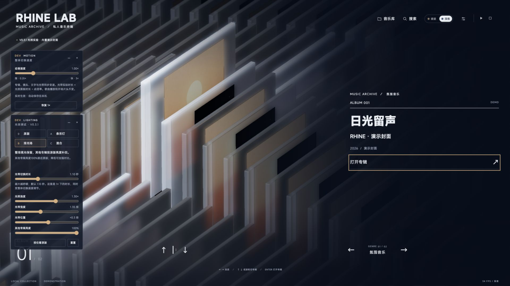
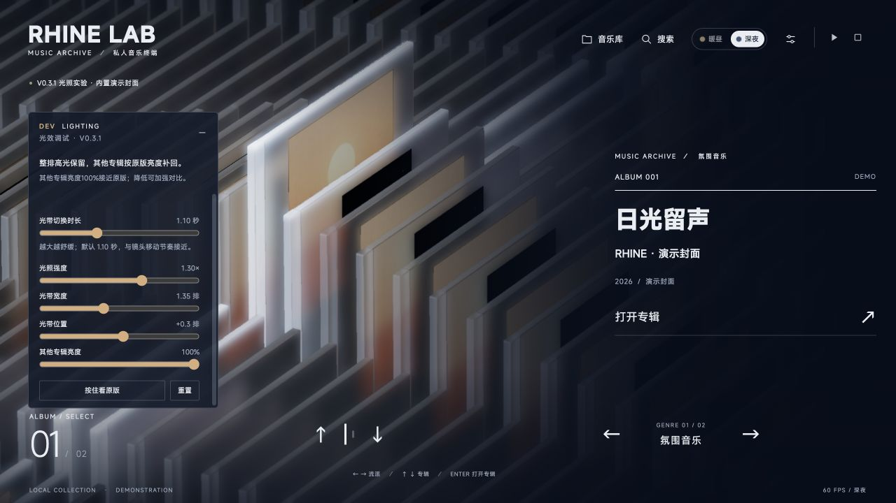
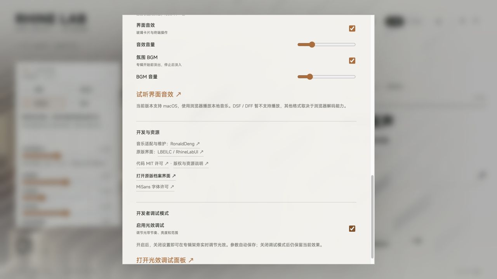
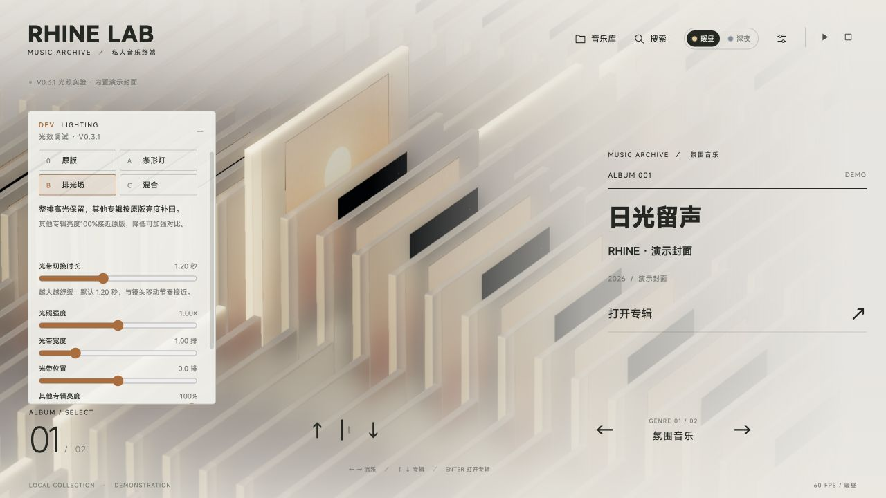
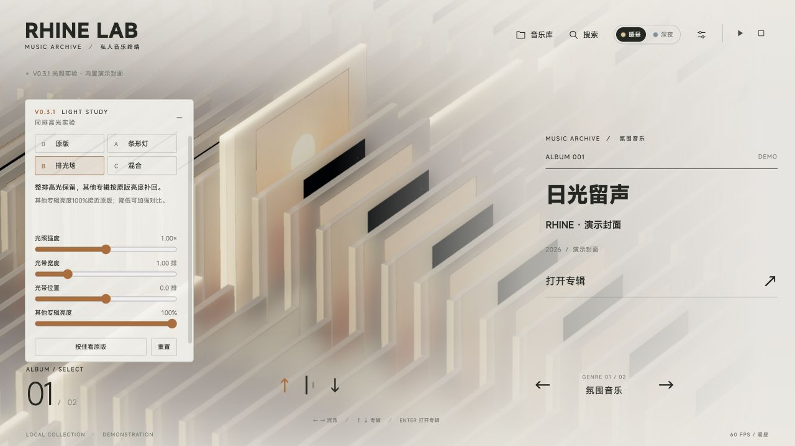
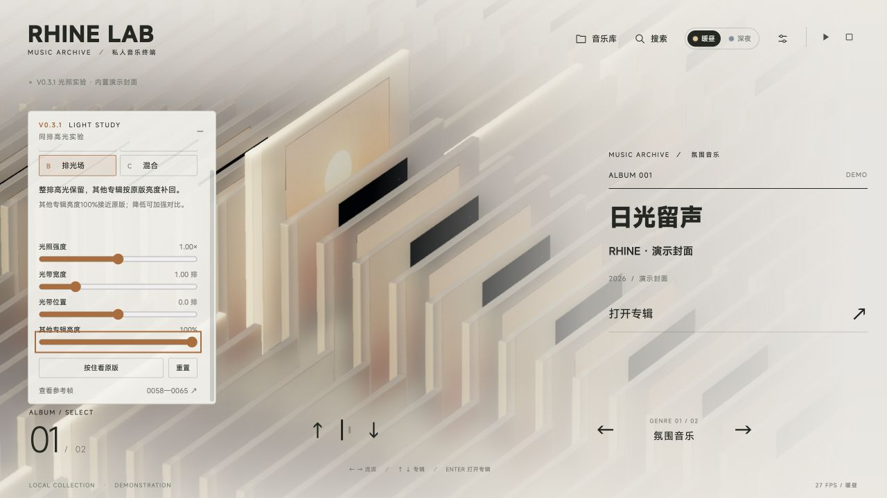
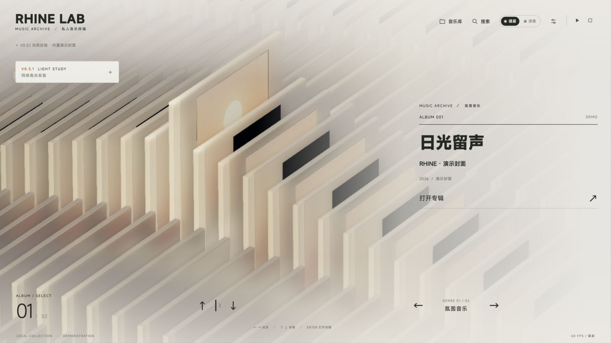
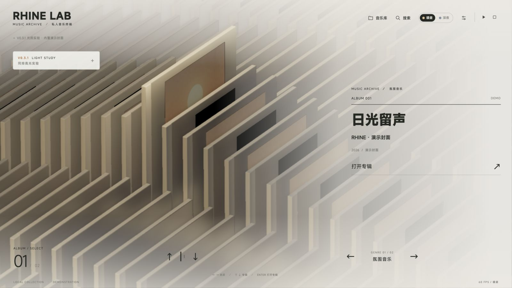
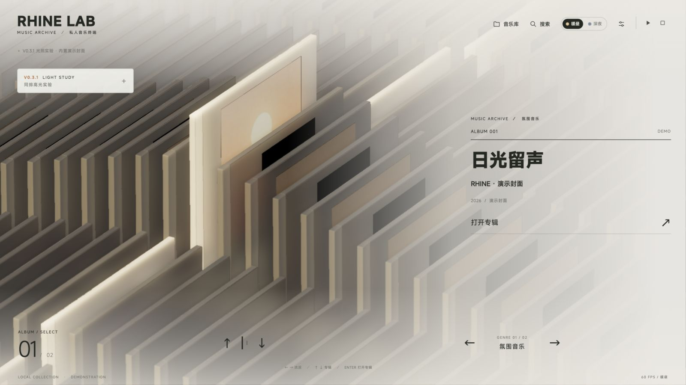
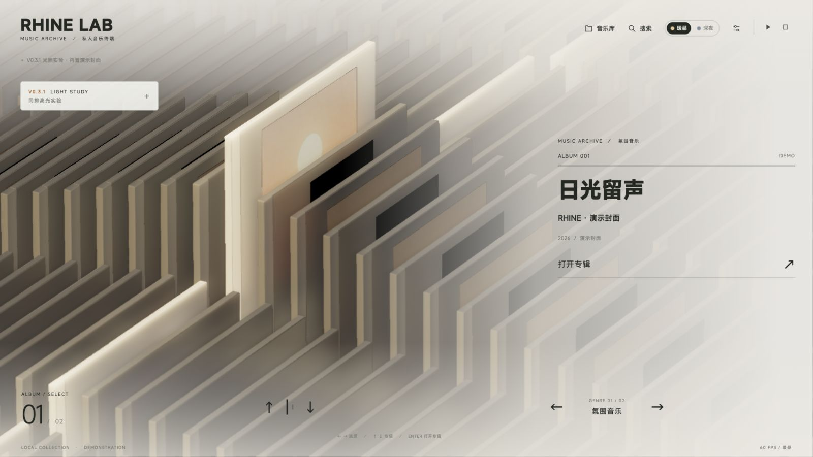

# V0.3.1 同排高光实验

研究日期：2026-10-01。基线为 V0.3.0；本实验比较 A 真实条形灯、B 世界坐标排光场、C 混合方案。目标是在现有 Three.js 阵列、材质与导航结构内，让同一排专辑形成明确的亮度带，保留玻璃质感、封面颜色与相邻排层次。

本文件记录参考观察、实现、实际验证及当前结论。实验实现了同排高光的视觉特征，但不是对原视频灯光算法的反演。

## 整体切换速度、双面板与滚轮（2026-10-01）

设置最底部现在可分别开启「光效调试面板」与「动画速度调试面板」。两者可共存，标题右端先收起再关闭；关闭只隐藏对应面板并保存其开关，不重置参数。面板放在共同的可滚动容器内，小屏也能访问全部控制。

整体切换倍率范围 0.25×–3×，默认 1×，作用于专辑架移动、镜头、抽取/返回、详情换片、标题字轮、导航、文字显示与光带。三维与光带共用一次缩放的时间增量，因此光带实际主要位移时长约为面板基准秒数除以整体倍率；例如 1.40 秒与 2× 组合约为 0.70 秒。光照强度、宽度、位置、补光仍独立保存。关闭两个面板不改变这些设置；同一浏览器、同一站点重新打开会恢复，无需为调节刷新。不同端口的本机偏好不共享。

歌曲和 BGM 播放速度、约 5.2 秒片头、减少动态效果优先级保持原样。正在播放的三维、字轮及滑尺动画可以中途改速；已开始的纯 CSS 过渡完成当前一次后采用新倍率。字轮收尾依据真实动画完成事件，避免低速时被旧固定计时器截断。

鼠标滚轮/触控板上下滚动通过现有专辑导航在当前歌手或分类列内循环，快速输入每次最多跨三张，微量输入累积，反向及时清除旧方向余量。滚轮不会跨列，也不会抢占设置、调试面板、详情内容或 Ctrl 缩放/水平手势。

验证：生产构建、`npm run check:interaction`（含 22 项展示编排、3 项字轮/滑尺回归及速度/滚轮检查）、光照/片头、相机、材质、阵列和视口检查通过。速度检查覆盖 0.25×/1×/3×、20/30/60/120 fps 及独立光效时长叠加。浏览器使用内置三张封面，检查双面板独立关闭/收起/重开、2× 与 1.40 秒同时保存并从无参数地址恢复、当前歌手列滚轮导航、调试区滚动隔离、0.25×详情进入与3×详情切片/返回；检查 390×844、1920×1080 布局。无新增脚本或 shader 错误；仍有既有 Three.js 阴影类型弃用提示。演示封面没有曲目，此检查不代表真实歌单长列表或音频解码验证。

## 当前默认：用户确认的 B 参数（2026-10-01）

采用用户截图选定的参数作为首次使用与重置的默认：B 排光场，切换 1.10 秒、强度 1.30×、宽度 1.35 排、位置 +0.3 排、其他专辑亮度 100%。原版对照的中性参数保持独立；显式 URL 和用户已经保存的设置继续优先。

移除调试面板底部「查看参考帧 0058—0065」及其查看弹窗，界面不再展示研究帧号。研究出处与历史验证记录保留在本文档中；下文参数与截图按记录当时的版本理解。

已通过生产构建、光照回归与差异格式检查。浏览器验证「重置」后五项数值均与用户截图一致，参考帧按钮不存在，未观察到脚本或 shader 错误。

## 切换节奏与开发者调试模式（2026-10-01）

上一轮的一阶无过冲跟随 rate 14 虽然消除了错亮邻排，但约 0.21 秒就完成 95% 位移，且起步速度最大，比阵列／镜头约 1.28 秒的节奏快得多。用户键盘切换或点击专辑时因此感觉光带过急、收尾过早。

改为专辑架坐标内的有界临界阻尼跟随，默认约 1.20 秒完成主要位移；由静止柔和加速，再缓慢收尾，同方向连按延续速度，反向去掉背离目标的速度，并保持不越过目标排。新增 `transitionDuration`（秒），范围 0.40–2.40，独立于进场扫光时间；调节时沿当前位置继续，减少动态效果仍直接对齐。原版宽柔光不变。

设置最后一节新增「开发者调试模式」，默认关闭。开启后可用「打开光效调试面板」回到专辑架边操作边调节。现有 A/B/C、强度、宽度、位置、补光与新切换时长统一留在光效调试面板，后续光效参数继续使用同一入口。开关与参数保存在原有本机偏好中，显式 URL 参数优先；关闭模式不会重置视觉效果，重置按钮恢复默认 B 和 1.20 秒。

本轮光照回归直接验证 30/60/120 fps 下不同切换时长、起步缓和程度、与阵列移动的进度差、连续输入与反转、实时修改时长及坐标重置；默认光带与 rail 在 0.1／0.3／0.6／1.2 秒的进度差均小于 4%。浏览器已检查键盘切换、鼠标点选、设置最末项入口、时长两端、URL 覆盖、本机参数及模式开关持久化、关闭后保留效果、重置恢复默认。生产构建与光照／相机检查通过。

另验证从专辑详情进入调试会返回专辑架，设置关闭模式时 Tab／Shift+Tab 正确绕过隐藏按钮；切换 A/B/C 或临时原版比较保持光带运动连续，不重置到目标位置。浏览器未观察到新的脚本或 shader 错误。

## 进场扫光与快速切换修复（2026-10-01，节奏后续调整见上文）

用户报告进场没有扫过阵列，以及快速前后操作会错亮目标前后相邻排。复现后确认：

1. 原演示链接附带 `scene=archive`，直接跳过 5.2 秒开场；即使移除参数，实验光带在 cinematic 分支也只锁定选中模型，没有自己的扫动轨迹。浏览器冷启动还暴露出首次材质编译约数秒的停顿，原墙钟计时会跳过前半段开场。
2. 阵列 rail 以 rate 3.7 缓动，原光柱又以 rate 5 跟随选中模型的最终世界位置，两次滤波在专辑架内形成相对过冲。60 fps 每隔 0.1 秒连续前移三排后，旧逻辑的光带曾到达目标之外约 0.73 排，此时下一排的场强反而是目标排的约 3.6 倍。反向操作还会延续旧速度。该问题在 30/60/120 fps 都可复现，不能靠提高帧率解决。

这轮先让 A/B/C 共用独立的排光位置：在绝对逻辑行列中做一阶指数跟随（rate 14），再叠加当前专辑架的真实世界位移。每帧结果严格在上帧位置和最新目标之间；坐标重置仍保持位置连续。该轮的快速跟随已由上文的柔和节奏取代，坐标隔离和不越界约束继续保留。原版宽范围柔光独立保留，B 的补光参数不变。

进场光带沿现有几何波浪的出发／返回节奏扫过阵列，并在工程时间 25.75 秒落回选中排，留出稳定交接时间；完整片段仍至 27.12 秒结束。轨迹是本工程的调校结果，不宣称还原原视频内部算法。开场时钟按实际帧推进、单帧最多 50 ms，正常帧率下保持约 5.2 秒，首次编译或后台停顿不会把整段扫光吞掉。跳过及减少动态效果直接对齐选中排。

默认[演示入口](http://127.0.0.1:5311/?demo=1&light=guided)与双击启动器都播放完整开场；`scene=archive` 仍可手动添加，用于静态对照。

新增回归验证把真实阵列弹簧与光带一起运行，覆盖 30/60/120 fps 连按、反转、跨行跨列、运动中坐标重置、完整扫光及多个时刻跳过。代码复核另补上曲库刷新／排序清零坐标时的光带重置，防止旧绝对行号残留。旧检查只测试固定世界坐标下的单独光柱，未覆盖导致过冲的联动条件。

本轮 `npm run check:lighting`（含新联动与开场时钟检查）、运动／相机／阵列检查、生产构建与 `git diff --check` 通过。浏览器实际验证连续前移三排后反向归位、详情进入／返回、完整进场和中途跳过；修复后开场截图采样从工程时间 21.97 连续经过 23.0、24.0、25.0 至 27.12，不再从 25.47 才出现。未观察到 JavaScript 或 shader 错误。V0.3.0 工作区仍无改动。

[进场扫光的实际浏览器截图](media/v0.3.1/08-opening-sweep.png)，取自工程时间约 24.47 秒的返回阶段。

## B 方案补回原版亮度（2026-10-01）

用户偏好 B 的外观，但认为其他专辑太暗。本次保留 B 的光带范围和核心高光，把玻璃的非高光基础曝光由固定 0.56 补回原版约 0.96–1.04；封面由初版的低固定底光补回原版随位置变化的漫射曝光，保持图案与色彩。

新增“其他专辑亮度”参数 `fill`，范围 0–1，默认 1：100% 接近原版底光，0% 重现初版 B 的暗底；中间值连续变化。仅 B 使用该参数，A/C 与原版对照保留。光照强度、光带宽度、光带位置继续独立调节，所有参数随 URL 保留；默认及重置改为 B。

本轮已通过 `npm run check:lighting`、`npm run build`、`git diff --check`，并在浏览器验证补光滑杆的 0/100% 端点、URL 保留与无 shader 编译错误。新增检查直接执行生产曝光表达式，确认未命中排恢复原版漫射曝光、核心不变、A/C 不受补光控制影响。

下文三方案结论和旧对照图保留首次实验记录；当前默认以本节的 B 方案为准。

## 参考与帧号

研究时已阅读本地原分析报告，逐张检查 0058–0065 共八帧。报告和参考视频帧不随公开仓库或源码包分发。原报告的 F 编号从 0 开始，图片文件从 1 开始；时间从这段参考视频第一帧起算，与工程动画时间不直接等同。

| 图片 | 报告帧号 | 参考视频时间 |
| --- | --- | --- |
| 0058.jpg（本地研究帧） | F057 | 2.28 秒 |
| 0059.jpg（本地研究帧） | F058 | 2.32 秒 |
| 0060.jpg（本地研究帧） | F059 | 2.36 秒 |
| 0061.jpg（本地研究帧） | F060 | 2.40 秒 |
| 0062.jpg（本地研究帧） | F061 | 2.44 秒 |
| 0063.jpg（本地研究帧） | F062 | 2.48 秒 |
| 0064.jpg（本地研究帧） | F063 | 2.52 秒 |
| 0065.jpg（本地研究帧） | F064 | 2.56 秒 |

八帧仅用于当时的本地研究，原存放目录 `public/lighting-reference/` 已列入忽略规则，不进入公开仓库或源码包。分析报告与参考帧均不是产品运行或构建依赖；研究使用不代表获得公开分发授权。本文保留帧号、观察结论和项目自身的演示截图。

## 可以直接观察到的效果

- 亮带沿画面左下至右上的方向，贴着专辑长边，跨越至少三个前后分组；各分组对应位置的端面也一起变亮。视觉上读作同一排被照亮，而不是单张专辑周围的一团光。
- 高光核心偏暖白，周围浅金，未命中专辑保持米灰。主要差异来自亮度，不是把整张专辑染黄。0058、0063 的光带最清楚；其他帧强度较低，但仍能看到暖边与端面响应。
- 高光有柔和溢出，片间缝隙与遮挡仍存在。画面中没有明显的空气光锥或圆形聚光灯斑，HUD 黑字、定位点和线条没有一同染黄。
- 同时发生的右侧几何波动改变了顶边高度、轮廓和遮挡。它造成大片亮暗变化，但与细长暖光带是两层效果。把一排抬高并露出亮面，不能独立满足本实验的光照目标。

这些图像不能唯一确定原作使用了移动灯、条形灯、材质发光、后期合成或它们的组合。高光在屏幕中的位移也同时受相机和模型运动影响，不能据此断言存在独立扫光轨迹。

## 现有架构与长短轴纠正

现有 `MusicSelectionLighting` 已通过共享 shader 为实例、选中模型及归位模型施加光场，封面又有独立着色入口，因此不需要替换 Three.js、重建模型或增加专辑数量。

工程坐标中，`lane` 沿世界 x 排列，间距 5.2；`row` 沿世界 z 排列，间距 0.62。参考中跨多个分组延伸的同排亮带，对应 **沿 x 展开、沿 z 收窄**。相机变化后它可以在屏幕上呈斜线，不能把屏幕横向或纵向直接当作排方向。

V0.3.0 的局部光场以 x 半径 3.2 收窄，而 z 的主要衰减尺度为 5.5，约为九个行距。它适合强调选中附近的区域，却不容易产生狭窄而贯穿多列的整排高光。实验首先改变这组长短轴关系，再调节玻璃边缘、顶缘与封面的响应。

光场应依附实际世界位置，兼容阵列滚动、坐标重置、波浪和抽取；不能仅根据屏幕位置叠加渐变。壳体可有暖色散射和边缘高光，封面通过受光明暗保留图案，不能套用壳体的发光项。

## 三种方案与边界

| 方案 | 实现思路 | 主要优势 | 主要限制 |
| --- | --- | --- | --- |
| A：真实条形灯 | 使用细长 `RectAreaLight` 沿目标排布置，照射现有物理玻璃材质 | 法线、角度与距离自然影响高光，适合观察真实材质反射 | 发光面细长不意味着受光范围同样狭窄；升降会改变命中强度，可能照亮邻排。当前 Three.js 的此灯不支持阴影，也不直接作用于封面使用的 `MeshLambertMaterial` |
| B：世界坐标排光场 | 对 z 距离做窄带衰减，沿 x 覆盖多个 lane；在原材质中控制受光与边缘散射 | 同排范围清晰、可控，能直接复用实例结构和封面入口 | 属于艺术化近似，不会自动计算物体之间的光传播；过强的加色会看起来像自发光或涂白 |
| C：混合 | 用 B 控制整排范围与邻排对比，以较弱的 A 提供方向性反射和角度变化 | 同时保留明确排光与玻璃的角度响应，是优先比较的候选 | 参数耦合较多；必须限制相加后的峰值，并避免把两层效果调成两条亮带 |

A 的封面材质限制是当前架构下的真实差异；本轮不为抹平差异而强行换掉印刷材质。B/C 可以使用既有封面光场入口调节明暗。条形灯没有新增阴影，不应把现有接触阴影误认为其投影。

B 的材质运算可以复用现有渲染通道；A/C 增加灯光求值。实际代价仍受屏幕像素、玻璃透射、后处理和设备影响，本研究不承诺固定帧率或成本比例，也不把无新增阴影通道等同于零性能开销。

## 参数起点

以下是用于迭代的世界单位起点，不是从视频反演出的测量值，也不要求最终实现逐项照搬：

- z 主带衰减尺度约 0.35–0.55，中心排最亮；较弱的邻排溢光尺度约 0.8–1.1。按实际公式核对宽度含义，不能直接把衰减尺度称作可见带宽。
- x 覆盖范围至少容纳三个 lane，先从约 16–26 的总跨度试起；远端可缓慢衰减，避免每一列完全相同而缺乏空间层次。
- A 的发光面使用长宽差明显的矩形，长边沿排方向。先确定位置、方向和可见反射，再调强度；不能只靠提高灯强弥补覆盖不足。
- 壳体核心使用暖白，弱溢光用浅金；封面保留原颜色。优先压低非命中排的局部受光并适度提高目标排，避免依靠全局曝光让白色背景和玻璃一起溢出。
- 不将高光增益绑定到几何波峰。静止与运动两种状态都应能看出同一排的亮度差；切换目标时连续移动或交叉淡化，避免离散跳亮。

## 如何体验与比较

启动本地 V0.3.1 服务后，打开[混合方案演示](http://127.0.0.1:5311/?demo=1&scene=archive&light=hybrid)。`demo=1` 使用内置示例封面，适合隔离个人曲库进行比较；实验面板提供原版基线与 A/B/C。初次实验曾提供本地参考帧查看器，后来已移除，公开版本不包含参考帧。

先固定相机、选中排与动画状态，依次比较基线、A、B、C。研究时重点检查了 0058 与 0063 的跨排连贯性，再对照其余六帧，避免只匹配一张最亮静帧；公开版本可用本文所附的演示截图比较。随后移动选中项、打开专辑并归位，观察动态连续性。参考视频时间与工程时间尚不能直接互换，历史帧对照仅用于外观判断。

验收时分别检查：

1. 同一 row 跨至少三个可见分组形成一致亮带，邻排明显较暗，整体仍是柔和的明亮空间。
2. 暖光贴着实体表面、顶缘和端面，缝隙可读；背景及 HUD 没有屏幕渐变式的染色。
3. 静止状态仍能清楚辨识高光排；波浪运动不成为亮度区别的唯一来源。
4. 封面保持图案与颜色，玻璃保留层次，不出现一排纯白平片。
5. 选择移动、抽取、归位以及实例与独立模型交接时，不发生突亮、熄灭或高光脱离模型。
6. 在实际主题和屏幕比例下检查覆盖宽度与对比度，再决定默认方案；参考外观优先，不以最高峰值亮度作为最好方案。

## 首次实验验证记录

2026-10-01，在 macOS Codex 内置浏览器检查生产构建。仅使用内置三张演示封面，未连接、扫描或修改个人曲库。默认强度 1、B/C 光带半高全宽 1 排（0.62 世界单位）、偏移 0；A 的宽度控件为灯面尺寸倍率，实际受光范围不能直接解释成排数。

- `npm ci`、`npm run build` 通过，TypeScript、Vite、PWA 生成完成；保留现有大产物提示。
- `npm run check:music` 全部通过（音乐库/介绍 16 项、播放器 4 项、展示状态 21 项，以及阵列、相机、运动、原光照和模型检查）。
- `npm run check:lighting` 通过：包含原版检查，以及新增排宽/偏移、跨列连续性、生产 GLSL 光场、参数边界、世界坐标交接、主题、详情和减少动态效果检查。
- `npm run check:viewport`、`git diff --check` 通过。V0.3.0 工作区仍无改动。
- 实际浏览器检查 1600 × 900 暖昼四方案、混合方案深夜、换片后进入详情、详情 Esc 返回、390 × 844 暖昼主页/详情。窄屏面板默认折叠；已修正它与顶部状态/返回区域的重叠。
- 已操作光带位置滑杆至 +6 排、重置、Space 临时原版对照、参考 0058/0065 切换与 Esc 关闭。最终对照图使用“减少动态效果”固定阵列姿态，证明亮度差不依赖几何波动。
- 生产构建未观察到新的 JavaScript 或 shader 编译错误；Three.js 保留已有 PCFSoftShadowMap 弃用警告。浏览器当次显示约 60 FPS，仅作为运行观察，不是跨设备性能基准。

光场检查得到的中心/邻排比值是着色控制量，不等于最终截图亮度比。真实封面内容、阴影、玻璃透射、雾、色调映射和屏幕均会改变输出。未验证真实音乐播放、全部封面、全部GPU、原片相机逐帧重合或完整进场时序；普通入口仍保留原有进场，光照的进场锚点已通过代码行为检查。

## 初次实验比较与建议

| 方案 | 实际观察 | 判断 |
| --- | --- | --- |
| 0 原版 | 选中附近是宽范围暖光，几排亮度相近，远端对应排不突出 | 留作基线 |
| A 条形灯 | 玻璃顶边反光自然，但同时提亮附近几排；封面不直接响应条灯 | 单独使用不够接近参考 |
| B 排光场 | 单排跨前、中、后分组清楚连续，邻排暗差明确，边界利落 | 稳定、可控的候选 |
| C 混合 | 保留 B 的单排范围，再由较弱条灯增加顶边和端面的自然变化 | 当前默认，建议优先试用 |

B/C 都满足“同一排明显更亮”。当前推荐 C；若更喜欢克制的边缘，选 B。保留参考中的亮度关系，但本项目有彩色封面、不同玻璃结构与既有相机，因此不宣称逐像素相同。进入完整详情时三方案平滑恢复原选中光，面板会提示返回专辑架比较。

**性能边界：** 没有新增几何 draw call、后处理或阴影渲染 pass。新增一盏 RectAreaLight 及 LTC 查表；为使四方案即时切换无需改变 shader 灯表，0/B 中也保留这盏零强度灯的共同着色器开销。故不能用实验页内的 FPS 直接断言相对原 V0.3.0 完全零成本。

## 初版同姿态对照图

1600 × 900、暖昼、日光留声、强度 1、宽度 1、偏移 0，开启减少动态效果。图片为实际浏览器输出。

[混合方案深夜](media/v0.3.1/04-hybrid-night.png) · [390 × 844 竖屏](media/v0.3.1/05-hybrid-portrait.png)
