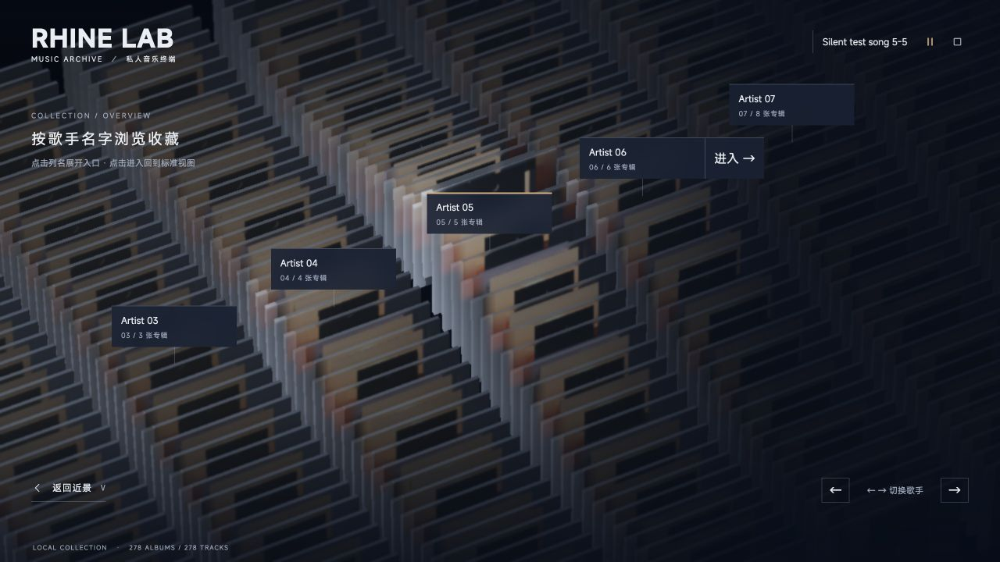
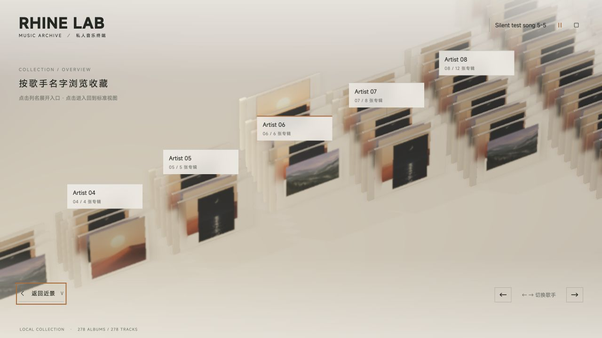

# 缩略图与搜索定位动效复核

日期：2026-10-07。工作范围为现有 V0.4.0；历史版本只读对照。用户确认：第一次点击歌手标签只原地向右展开「进入 →」，点击进入后才定位并返回标准视图。

## 原因与历史基线

本轮对照实际源码，不能把旧文档的时长或光带测试当作音乐架的运动验证。

| 版本 | 与本次有关的实际行为 |
| --- | --- |
| V0.1.0 | 详情用约 1.381 秒五次轨迹，模型抽取与镜头共享进度；浏览行列使用临界阻尼。 |
| V0.1.1b | 增加保持详情构图的快速换片；普通浏览轨道仍使用原阻尼。 |
| V0.2.0 | 搜索明确采用返回专辑架再定位的路径，与详情内换片分离。 |
| V0.3.0 | 优化取景、字轮裁剪、封面连续性与播放歌名定位，核心轨道节奏未变。 |
| V0.3.1 | 增加 0.25×–3× 整体倍率并调整光带运动；光带的柔和起停没有改变音乐架远距离定位轨道。 |
| V0.4.0 初版 | 先退浏览文字再抽取，缩小正文位移；新总览没有完整接入界面的出入场生命周期。 |

继承的设计语言包括：空间先移动并落稳，再显示阅读信息；短位移和细线层级；460ms 直接字轮；浏览层 720/140ms、详情层 360/240ms；播放歌名宽度 640ms、透明度 400ms；可打断时从当前位置继续。详情正文在 V0.4.0 已从历史 36/52px 改为 24/32px。`DESIGN.md` 下方的 V0.3.0 历史部分保留原日期，新版行为以本记录及专项日志为准。

### 缩略图

- `setOverview` 原来直接改变整个总览的 `hidden`；说明、下方控制器没有退入场，返回按钮由 `top` 直接切换成 `bottom`。
- 新标签按当前可见集合立即插入、移除；仅父容器首次出现有 480ms 淡入，后续进入视野的标签没有独立动画。
- 歌名被总览 CSS 的 `display:none` 隐藏，与实际播放状态无关。其他顶部控件消失改变了 flex 行高：1280×720 隔离演示中，播放和停止按钮的 top 从 38.75px 变为 35px，产生 3.75px 竖直跳位。
- 三维循环池只保留 9×48 个位置。远景能看见池边缘，列在回收边界直接替换身份和封面时，可能以完整尺寸进入画面。标签淡入不能修复三维补列本身。

### 搜索定位

搜索正确使用 `archive` 路径，没有误用详情内的快速换片。问题来自普通浏览轨道的固定阻尼系数：横向和纵向为 3.7，列强调为 4，行强调为 5。

从静止开始，临界阻尼的初始加速度为 `rate² × 距离`。移动距离越长，前段加速度与峰值速度越大；rate=3.7 时约 270ms 达到峰值。纯轨道计算的前 100ms 已走完 5.37%，而 1.381 秒详情五次轨迹同期只走 0.34%。这解释了远跳与抽取的节奏差异；这些数值是轨道计算，不是设备录屏帧率。

## 实现

### 总览界面

说明、返回和切列控件使用 460ms 进入、240ms 退出，短距离上下移动配合淡入淡出。标准视图的开关和总览返回控件分别拥有固定位置，不再把同一个节点从顶部瞬移到底部。顶部其他入口保留布局并渐隐，当前歌名和播放/停止的位置保持不变。

每个歌手标签拥有独立生命周期，退出完成后才移除；反向输入从当时画面继续。外层跟随真实投影与列边缘可见度，内层负责界面淡入淡出，避免两个动画争用同一个 transform 或 opacity。边缘有进退缓冲。标签第一次点击仅展开右侧 76px 入口，420ms 完成；屏幕右侧预留入口宽度。点击「进入」才选择该列记忆中的专辑，平滑返回标准视图，待空间落稳再显示浏览文字，不直接打开详情。

总览三维池边缘在距离中心 3.5–4.5 列间按五次曲线从阵列基底展开／收回，宽度和厚度不变。壳体、封面、选中模型和归位副本共用同一变换；回收边界高度为零。标签持续投影至同一边界并同步渐隐，低可见度实体不可点击。没有扩大 9×48 实例池或新增纹理、材质通道。标准视图在总览退场结束后不做整库标签投影。

### 搜索与程序化定位

列位置、前后轨道、列强调与行强调采用同一计时器的五次轨迹。1× 时近距 1.4 秒，随归一化行列距离平滑增加，最长 2.4 秒。静止起止时速度、加速度均为零，轨道精确收敛，无旧指数尾部。保留详情原有约 1.381 秒轨迹和详情内快速换片。

| 轨道例子 | 新时长 | 原轨道前200ms位移 | 新轨道前200ms位移 |
| --- | --- | --- | --- |
| 1列、0行 | 1.400s | 16.982% | 2.326% |
| 4列、30行 | 2.040s | 16.982% | 0.809% |
| 8列、80行 | 2.400s | 16.982% | 0.509% |

详情五次轨迹同期为 2.416%。以上均为 1× 的数值轨迹验证，不代表实际设备帧率或完整搜索总耗时；完整流程还包括面板退场、必要的旧详情归位、镜头收束与新详情打开。

轨道支持继承位置、速度、加速度以及坐标重置；继续使用现有状态机的取消和最新目标规则。**搜索已处于行列移动阶段时，新搜索仍排队替换最后目的地，当前移动落稳后再前往新目标；本轮没有改为即时改道。** 新动效只应用一次全局倍率，减少动态效果直接完成。

## 验证结果

- `npm run check:interaction`：原文字3项、呈现流程25项、滚轮与倍率检查通过；新增四轨专项覆盖20/30/60/120fps、0.25/1/3×、减少动态、中途反向、阻尼交接、坐标重置、落稳条件与回收边界。
- `npm run check:overview`：真实数量、居中、投影、视口筛选和新增UI生命周期检查通过。包括两步入口、锚点保持、退出留存、反向打断、透明度分工、右侧入口完整性。
- `check-music-camera.mjs`、`check-music-scene.mjs`、`check-music-renderer-startup.mjs` 通过。渲染启动检查采用受控GPU替身，不作为真实帧率证明。
- `npm run build` 通过（TypeScript、Vite、PWA）。保留既有的大包体提示。
- 独立复核发现并修复超宽屏退出标签冻结：生产投影与真实Object3D顶点在2560×1080、3806×1622的4.01/4.2/4.49/4.5列位置一致。

真实浏览器使用隔离端口和自生的14位歌手、278张专辑；每列张数为1/2/3/4/5/6/8/12/24/48/55/100/3/7，封面仅复用内置三张演示图。音频是静音WAV，不访问个人索引或在线资料。

- 1280×720深夜：播放/停止按钮切换前后top均38.75px；歌名保留。点击Artist 03标签前后主体坐标完全相同，当前歌手仍为Artist 01；点击进入后到达Album 03-001标准视图，没有打开详情。
- 标准视图搜索Album 12-050，最终正确显示其详情；已打开详情时搜索Album 05-005，正确返回、定位再打开。
- 3806×1622与2560×1080深夜：多列切换、边缘标签投影及入口屏内布局检查。3806视口截图受到浏览器捕获宽度限制，未将裁切图作为完整截图交付。
- 390×844暖昼：播放/停止按钮切换前后top均75px；展开入口在屏内，页面clientWidth/scrollWidth均390。真实列与减少动态下的两步入口可用。
- 1280×720暖昼真实列：快速V反向后总览仍可见可用；总览歌名定位正确退出总览并进入对应歌曲详情。
- 浏览器未发现error；保留既有Three.js阴影类型弃用warning。未做个人完整曲库长期性能测试或音乐音质验证。

