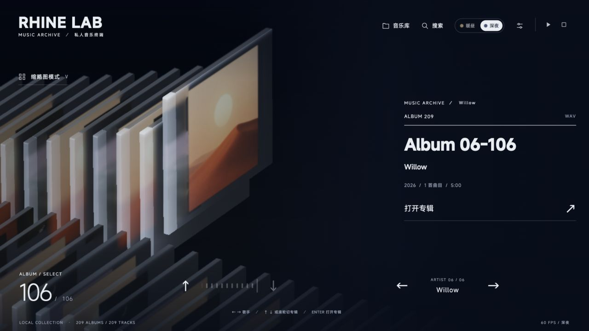
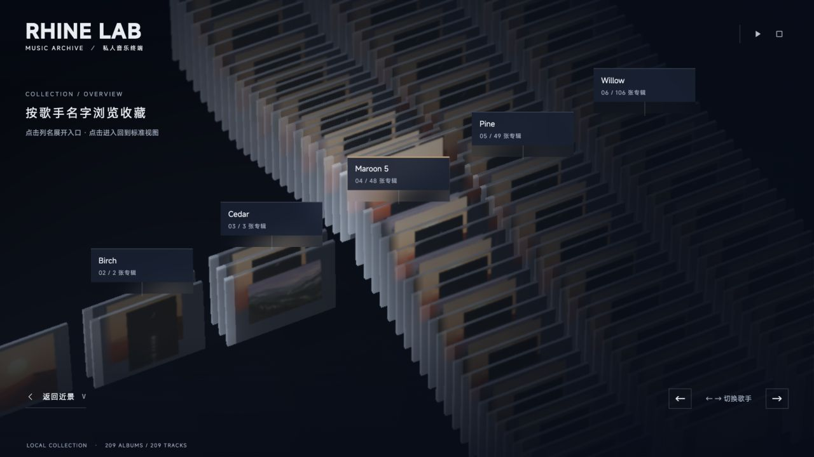

# V0.4.1 真实列独立浏览 · 2026-10-07

## 行为

真实专辑列的未选列保持整列居中，奇数张取中间一张，偶数张取中间两张之间。上下浏览只移动当前列；切到另一歌手时，离开的列平滑归中，其余列的位置与默认波浪保持连续。当前专辑仍是浏览焦点，列内移动不再带动整架纵向运动或邻列的选择跳动。

保留每列浏览位置仍默认开启：回到某位歌手时，平滑移向会话中记住的专辑。关闭后选目标列当前画面深度附近的专辑；真实未选列通常取中央附近，快速折返则依据该列当时的实际位置。填充模式继续使用全局深度和循环排列。

真实列内到首尾后不能继续前进，主页和详情的对应箭头置灰。键盘、滚轮、触摸、滑尺共用同一边界；单张列两个方向均禁用。连续输入按待处理位置判定边界，不会绕回或积累无效请求。左右歌手切换沿用原有循环行为。

## 实现

- `MusicRealColumns` 为每列维护独立深度和活动权重；普通本列移动沿用 3.7 临界阻尼，详情换片沿用 9，程序化定位及跨列归中使用已有 1.4–2.4 秒五次轨迹，重定向保留位置、速度与加速度。
- 场景使用每列自己的偏移抵消公共 rail；可见池、封面、选中模型、归位副本、拾取和总览标签共享坐标。48 是每列可见池容量，不是专辑数量上限。
- 默认波浪不随别列操作重启或熄灭，选择波纹限制在本列。真实模式的行输入不再驱动整个场景的相机倾动。
- 光带在真实列之间切换时换算新旧世界坐标原点；同列继续沿用既有跟随，避免再做一次世界坐标滤波。阵列模式切换仍沿用原有光带重置。
- 有限滑尺在首尾显示真实范围内的专辑，无回环副本；填充模式保留原来的循环滑尺。

## 自动验证

通过 TypeScript/Vite/PWA 生产构建，以及：

- `check:interaction`：默认偏好和保存、待处理导航与首尾禁用、详情切换、滚轮、滑尺、搜索记忆、快速反向、模式切换；新增独立列状态和运行时检查已纳入。
- `check-music-real-columns.mjs`：20/30/60/120 fps，0.25/1/3×，普通/详情/程序化轨迹、打断连续性、归中、overview、模式初始化和减少动态效果。
- `check-music-real-column-runtime.mjs`：执行生产可见池和矩阵代码，用真实 Three.js 实例及 Raycaster 检查壳体/封面身份、点击命中、归位副本交接、邻列坐标不受全局 rail 影响、相同时间只保留默认波浪、相机隔离。
- `check:overview`：长短列居中、奇偶中心、可见池与标签投影、列名展开/进入以及填充回归。
- `check:lighting`：短列与长列间的光带零时间连续、同列跟随、最终对齐、反向、重置、减少动态效果和开场。
- `check:startup`、camera、scene、motion、model：开场交接与跳过、原有相机/阵列/盒体回归。

## 浏览器验证

使用 127.0.0.1:5420 的隔离合成库，6 列数量为 1/2/3/48/49/106，共 209 张；仅内置示例封面和静音音频。未连接个人音乐库或外部资料服务。

在 1280×720 深夜界面确认：单张列双向禁用；两张列末端下箭头禁用，继续按向下键不回环；搜索 Maps 后打开详情，返回并切走再切回恢复第 28 张；关闭记忆后进入 49 张列选择中央第 25 张。106 张列末张的主页与详情下一张箭头禁用，搜索目标正确；总览列名先原地展开入口，点击进入后返回标准视图。浏览器没有脚本错误。

静态截图展示布局与控件状态；连续轨迹、时长和不受操作影响的邻列运动由生产代码自动回归验证。本轮未重新测试个人大曲库性能、真实音频格式和外接音频设备。

