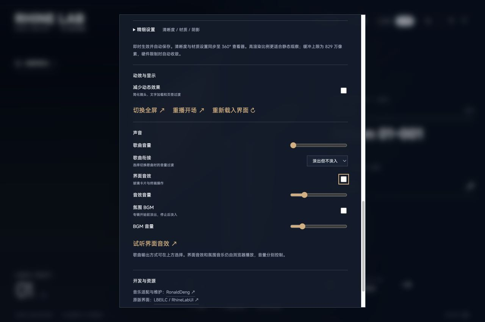

# V0.4.1 歌曲衔接 · 2026-10-07

设置中的“歌曲衔接方式”提供“淡出但不淡入 / 淡出淡入 / 无缝播放”，默认选择“淡出淡入”。本次发行补齐音频时钟上的连续排程；第三档不再只是取消淡变。

## 使用行为

- **淡出但不淡入**：手动切歌时，当前歌曲约 450ms 淡出，下一首直接以设定音量开始。
- **淡出淡入**：手动切歌时先淡出当前歌曲，再淡入下一首，每段约 450ms，两首歌不叠播。
- **无缝播放**：提前准备下一首，在当前歌曲的音频结束时刻接续播放；不加入淡变、交叉混音或额外静音，也不裁掉源文件本身的静音。

自然播完不提前削弱歌曲尾部。主动跳曲不等于自然接缝；它会取消旧的待播歌曲并播放新目标。暂停、恢复、跳转、停止、更改队列或输出方式，都要同步处理正在播放及预备的音源，过期准备结果不能再次发声。

设置只改变歌曲衔接方式，不改变歌曲音量、播放速度、界面音效或氛围音乐。播放歌曲前氛围音乐淡出，暂停时保持安静，停止或队列结束后恢复。旧 `songFade: true` 迁移为 `fade-in-out`，旧 false 迁移为 `gapless`；新的 `songTransition` 配置优先。

## 浏览器实现与边界

`BrowserGaplessPlayer` 使用同一个 AudioContext 的音频时钟，将下一首 AudioBufferSourceNode 预排到当前源的结束时刻。结束事件和定时器负责更新界面、补充后续预备，不负责启动已经排好的接续歌曲。音频上下文在用户播放操作中唤起，等待资料准备不会丢失第一次播放所需的交互机会。

无缝路线使用本机 FFmpeg / ffprobe 准备 PCM WAV，之后由浏览器解码并按 AudioContext 的采样率输出。因此不同源采样率可接续，但不代表 bit-perfect 或硬件采样率跟随文件变化。

为控制内存，只保留当前与下一首，串行解码；单首 WAV 下载上限为 **128 MiB**。预留预算为 **384 MiB**，包括已保留的 Float32 音频和输入解码所需的保守余量。这是引擎的资源策略，不是对整个浏览器进程内存占用的保证。

缺少 FFmpeg、不支持 Web Audio、文件超过预算或下一首没有及时准备好时，会显示原因并退回普通播放。浏览器自身支持的文件仍可沿用 HTMLAudio 播放；需要 FFmpeg 的格式在依赖缺失时不能因此播放。停止后重播、开始新的专辑队列或重新选择无缝模式可再次尝试。降级不会被描述为已经无缝衔接。

## CoreAudio 实现与边界

原生引擎用两个常驻 AVAudioPlayerNode 连接同一 mixer，按同一个音频时间轴提前排程下一首。边界不停止或重启引擎，不等待网页轮询发出播放命令。网页轮询只同步实际曲目身份、进度及队列结束状态，避免自动接续后重复跳曲。

初首使用完整预解码的 PCM 文件，后续同样提前解码并流式读取。输出 format 以初首采样率建立，至少双声道，初首多声道时保留其声道数。下一首经 FFmpeg 提前归一为当前引擎采样率的 Float32 PCM，并以独立缓存键保存；排程直接使用 PCM 文件的真实帧数，避免非整数采样率转换在边界引入一个采样点的缝隙或叠加。44.1 / 48 kHz 互换、单声道与双声道之间可接续。若后续歌曲的声道数超过已经建立的输出 format（如双声道转 5.1），会提示并退回普通换曲，重新建立输出，避免静默丢弃声道。

当前与下一首 PCM 具有缓存租约，不能被清理任务提前删除。单首 PCM 小于 2 GiB；4 GiB 是磁盘缓存回收目标，正在使用、受保护或同时解码的文件可能使占用暂时超过目标，不代表加载了同等大小的内存。服务最多同时执行两个 FFmpeg 任务。

每次预备一首。下一首解码太晚、当前剩余不足 20ms、极短曲目连续播放或输出设备变化时，不能保证该边界无缝。暂停、跳转、更换模式及手动换曲会取消旧预备。CoreAudio 继续使用共享模式，不承诺独占输出、自动切换硬件采样率或 bit-perfect。

## 验证方法

- 浏览器：使用生产 BrowserGaplessPlayer 和真实 Chrome OfflineAudioContext，离线渲染连续合成音频。比较完整双声道 PCM、接缝与结束后的静音，覆盖连续音频、不同采样率、取消下一首和跳转后接续；不连接真实声音设备。
- 原生：直接编译生产 Output 类，通过 AVAudioEngine 离线渲染检查真实输出样本，覆盖连续多首、混合采样率、单/双声道、取消和传输边界；另以零音量验证真实 CoreAudio 设备上的接续与结束。
- 生命周期：检查暂停/恢复、跳转、停止、队列替换、模式切换、后端切换、异步过期、曲目边界与网页状态同步；保留两种淡变、BGM 和旧设置迁移回归。

执行命令、最终结果和未覆盖范围以 [发行检查](RELEASE-V0.4.1.md) 为准。自动化合成样本不等于所有压缩编码、浏览器、USB / 蓝牙设备或长期听感都已验证。

