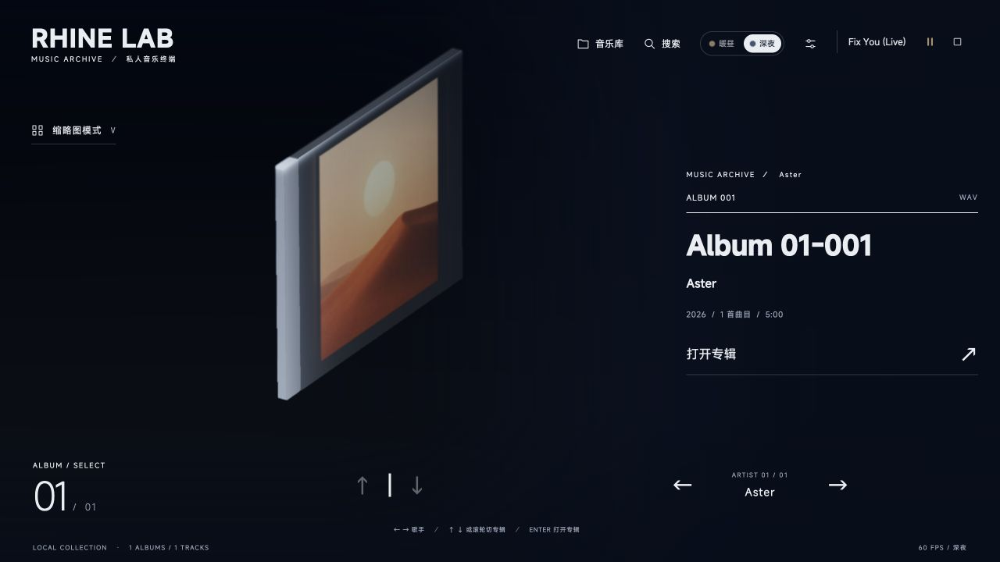

# V0.4.1 播放歌名尾部裁切 · 2026-10-07

用户截图中的 “Fix You (Live)” 末尾右括号只显示了一部分。该问题不是歌名内容不完整，而是测量和实际字轮排版不一致。

## 复现与修复

1280px 窗口、MiSans 12px 下，原整段原生文本和内层裁剪框宽度是 **72.1484375px**，实际逐字字轮宽度是 **73.515625px**，比裁剪框多 **1.3671875px**。因此尾字符被截断。字距组合不同的歌名，可能不会出现同样的裁切。

隐藏测量现与字轮一样按 grapheme 拆分，用单独 span 组成 flex 行；完整标题和带省略号的前缀使用同一组实际字形宽度。修复后测量与字轮均为 **73.515625px**，显示区域加两侧各 2px 绘制余量，宽 **77.515625px**；末字字轮的边界位于裁剪框以内。

保留原 460ms 字轮和 640ms 槽位过渡。空间不足时以完整字形加省略号显示，完整歌名仍保留在按钮辅助标签与悬停提示中。新增对测量层和字体加载的观察，窗口变化与减少动态效果继续生效；没有修改滚动字轮依赖。

## 验证

- TypeScript、Vite/PWA 生产构建及既有 7 项 UI 动效检查通过。
- 使用隔离浏览器页面加载生产组件、实际 MiSans 字体及样式，检查普通动画与减少动态效果两种状态。测试歌名含英文圆括号、方括号、中文全角括号、连字/字距组合、组合音标、ZWJ emoji 和超长标题。
- 1280/1000/390px 三种窗口、12/11/10px 实际字号，共 66 项布局检查通过：可见标题宽度不超过内容预算，完整标题无需截断时逐字相同，最后字轮的绘制边界位于内层裁剪框以内。结果见 [浏览器测量](media/v0.4.1/title-clip-checks.json)。
- 原因与边界判断来自实际浏览器布局尺寸，不以模拟字体宽度替代。
- 本轮未读取私人曲库；音频场景使用合成数据与静音文件。

实际播放器以静音样本播放 “Fix You (Live)” 后，完整辅助标题与尾括号均正确；最后字轮外边界距裁剪框右侧仍有 0.2109375px 余量（字形自身还处于字轮内部）。连续快速切换后最终标题仍正确，未发现浏览器脚本错误。

